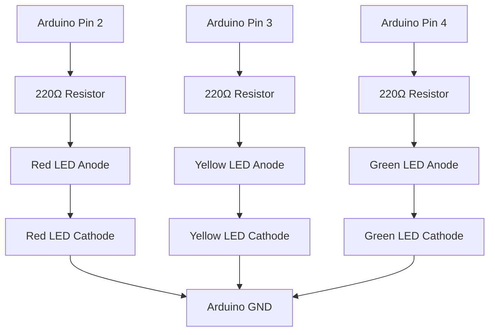

# Traffic-Light-Simulation

This project includes both hardware (Arduino) and software (Python) simulations of a traffic light.

## Hardware Simulation (Arduino)

### Hardware Requirements
- Arduino board (e.g., Arduino Uno)
- 3 LEDs (Red, Yellow, Green)
- 3 resistors (220Ω each)
- Jumper wires
- Breadboard

### Circuit Setup
- Connect Red LED to pin 2
- Connect Yellow LED to pin 3
- Connect Green LED to pin 4
- Use resistors in series with each LED to limit current

#### Detailed Pin Connections
- **Arduino Pin 2** → Red LED anode (+) → 220Ω resistor → Red LED cathode (-) → Arduino GND
- **Arduino Pin 3** → Yellow LED anode (+) → 220Ω resistor → Yellow LED cathode (-) → Arduino GND
- **Arduino Pin 4** → Green LED anode (+) → 220Ω resistor → Green LED cathode (-) → Arduino GND

**Note**: Ensure LEDs are oriented correctly (longer leg is anode). All cathodes share the same GND connection.

#### Graphical Circuit Diagram


#### Standard Circuit Schematic (ASCII)
```
Arduino Uno
+------------+
|            |
| Pin 2 ----[220Ω]---->|---- GND
|            |         LED (Red)
| Pin 3 ----[220Ω]---->|----+
|            |         LED (Yellow) |
| Pin 4 ----[220Ω]---->|----+       |
|            |         LED (Green)  |
| GND -------+----------------------+
|            |
+------------+

Symbols:
- ---- : Wire
- [220Ω] : Resistor
- >|---- : LED (arrow indicates anode direction)
- + : Junction
```

### How to Build and Upload
1. Install the Arduino IDE from https://www.arduino.cc/en/software
2. Open the `Traffic_Light_Simulation.ino` file in the Arduino IDE
3. Select your Arduino board type (Tools > Board)
4. Select the correct port (Tools > Port)
5. Click the Upload button (right arrow icon) to compile and upload the code to your Arduino board

## Software Simulation (Python)

### Requirements
- Python 3.x

### How to Run
1. Run `python traffic_light_simulation.py` in the terminal
2. The simulation will print the current light color every cycle

## Working Principle

Traffic lights are essential for managing traffic flow at intersections, ensuring safety by signaling when vehicles should stop, proceed, or prepare to stop. The standard sequence follows a timed cycle:

- **Red Light**: Indicates vehicles must stop. Duration: 3 seconds (allows time for traffic to clear).
- **Yellow Light**: Warns that the red light is imminent. Duration: 1 second (caution period).
- **Green Light**: Signals vehicles can proceed. Duration: 3 seconds (sufficient time for crossing).
- The cycle repeats indefinitely.

In this simulation:
- **Hardware (Arduino)**: Uses digital pins to control LEDs, mimicking real traffic lights with physical output.
- **Software (Python)**: Prints the current light state to the console, simulating the timing without hardware.

The code uses a simple loop to switch between states, with delays to simulate real-world timing. This demonstrates basic embedded programming and control logic.

## How It Works
The simulation cycles through the traffic light sequence:
- Red light for 3 seconds
- Yellow light for 1 second
- Green light for 3 seconds
- Repeat